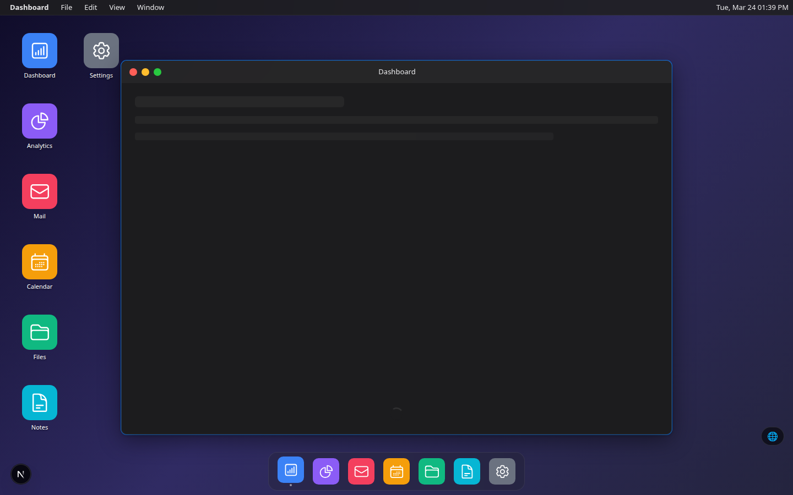
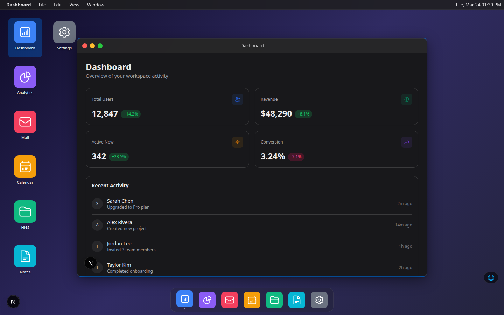
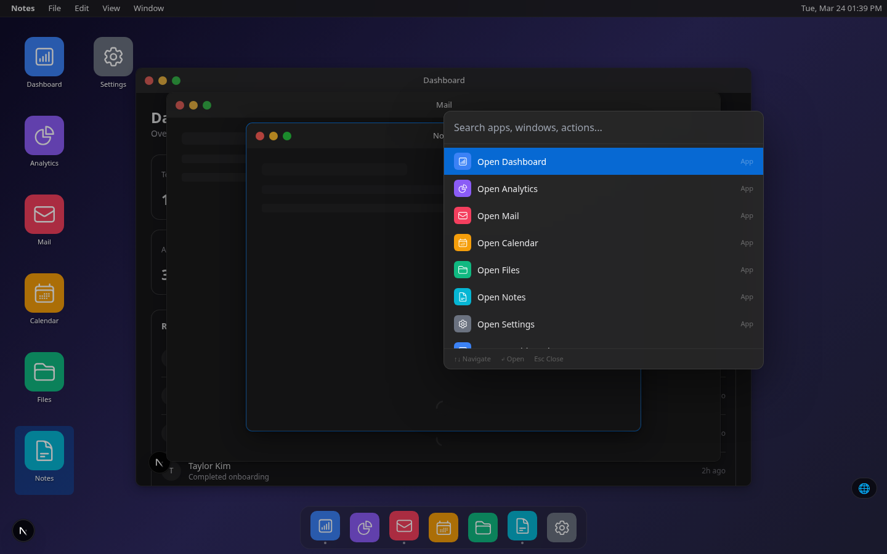
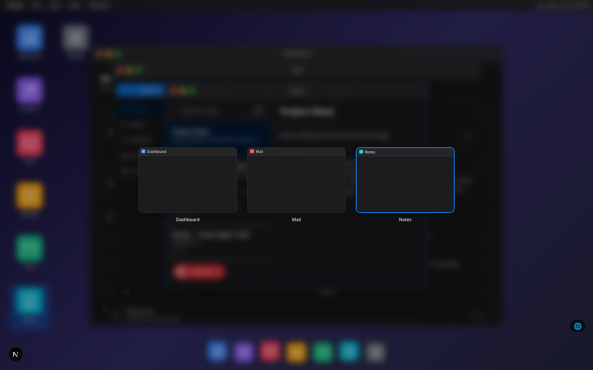

# deskui

A desktop OS shell for your web app. Drop it in and your product gets windows, a dock, a menu bar, and a full desktop experience — with zero changes to your existing pages.



## Features

- **Window management** — drag, resize, minimize, maximize, snap to edges (halves, quarters, thirds)
- **Menu bar** — app name, File/Edit/View/Window menus with keyboard shortcuts
- **Dock** — app icons with running indicators, badges, tooltips, auto-hide
- **Taskbar** — Windows-style alternative with window grouping and system tray
- **Command palette** — Cmd/Ctrl+K to search apps, windows, and actions
- **Mission Control** — F3 to see all windows in an overview grid
- **Window switcher** — Cmd/Ctrl+Tab to cycle through open windows
- **Context menus** — right-click on desktop and window titlebars
- **Notifications** — toast notifications and a notification panel
- **Lock screen** — idle timeout or Cmd/Ctrl+L with blurred wallpaper and clock
- **Themes** — light and dark themes with runtime switching, fully customizable
- **Color scheme** — auto-detects system preference, toggle in menu bar/taskbar
- **URL sync** — open windows based on URL path or query params
- **Desktop/Web toggle** — switch between OS mode and normal web mode
- **Picture-in-picture** — pin windows as small always-on-top overlays
- **Tab grouping** — merge windows into tabbed groups
- **Accessibility** — ARIA roles, keyboard navigation, focus trap, reduced motion, high contrast



## Installation

```bash
npm install deskui-react
```

Peer dependencies: `react >= 18`, `react-dom >= 18`, `framer-motion >= 11`

## Quick Start

```tsx
import { OSShell, useColorScheme } from 'deskui-react'
import type { AppDefinition } from 'deskui-react'

const apps: AppDefinition[] = [
  {
    id: 'dashboard',
    label: 'Dashboard',
    icon: <DashboardIcon />,
    route: '/dashboard',
    defaultSize: { w: 1000, h: 680 },
  },
  {
    id: 'notes',
    label: 'Notes',
    icon: <NotesIcon />,
    route: '/notes',
    defaultSize: { w: 600, h: 500 },
    instanceable: true,
  },
]

export default function Layout({ children }) {
  const { theme, toggle } = useColorScheme({ defaultScheme: 'system' })

  return (
    <OSShell
      apps={apps}
      theme={theme}
      taskbarVariant="dock"
      initialWindows={['dashboard']}
      onToggleColorScheme={toggle}
    >
      {children}
    </OSShell>
  )
}
```

Each app's `route` is rendered inside an iframe within its window. Your existing pages work unchanged — auth, routing, and styles are isolated.

## OSShell Props

| Prop                  | Type                                 | Default             | Description                                       |
| --------------------- | ------------------------------------ | ------------------- | ------------------------------------------------- |
| `apps`                | `AppDefinition[]`                    | **required**        | Apps available in the desktop                     |
| `theme`               | `OSTheme \| DeepPartial<OSTheme>`    | `defaultTheme`      | Full theme or partial override                    |
| `wallpaper`           | `string \| string[] \| () => string` | gradient            | URL, CSS gradient, array (slideshow), or function |
| `taskbarVariant`      | `'dock' \| 'taskbar'`                | `'dock'`            | macOS dock or Windows taskbar                     |
| `dockItems`           | `DockEntry[]`                        | derived from `apps` | Custom dock items with separators                 |
| `initialWindows`      | `string[]`                           | `[]`                | App IDs to open on mount                          |
| `defaultMode`         | `'desktop' \| 'web'`                 | `'desktop'`         | Initial mode                                      |
| `persistLayout`       | `boolean`                            | `false`             | Save/restore window positions via localStorage    |
| `lockScreen`          | `boolean \| { idleTimeout: number }` | `false`             | Enable lock screen                                |
| `syncWithUrl`         | `boolean \| 'read' \| 'read-write'`  | `false`             | Open windows from URL                             |
| `onToggleColorScheme` | `() => void`                         | —                   | Toggle button in menu bar / taskbar               |
| `onWindowOpen`        | `(appId: string) => void`            | —                   | Called when a window opens                        |
| `onWindowClose`       | `(windowId: string) => void`         | —                   | Called when a window closes                       |
| `onModeChange`        | `(mode) => void`                     | —                   | Called when desktop/web mode changes              |

## AppDefinition

```ts
interface AppDefinition {
  id: string
  label: string
  icon: React.ReactNode // React component, string URL, or { src, src2x }
  route: string // rendered inside iframe
  defaultSize: { w: number; h: number }
  defaultPosition?: { x: number; y: number }
  minSize?: { w: number; h: number }
  maxSize?: { w: number; h: number }
  resizable?: boolean // default: true
  instanceable?: boolean // allow multiple windows; default: false
  titlebarTitle?: string // override label in titlebar
  skeleton?: React.ReactNode // custom loading skeleton
  beforeClose?: () => boolean | Promise<boolean>
  renderTitlebar?: (props: TitlebarRenderProps) => React.ReactNode
  renderControls?: (props: ControlsRenderProps) => React.ReactNode
}
```

## Color Scheme

Runtime light/dark switching with system preference detection:

```tsx
import { useColorScheme } from 'deskui-react'

const { theme, colorScheme, setColorScheme, toggle } = useColorScheme({
  defaultScheme: 'system',  // 'light' | 'dark' | 'system'
})

<OSShell theme={theme} onToggleColorScheme={toggle} />
```

- Persists choice in localStorage
- Falls back to `prefers-color-scheme` system preference
- Color scheme passed to iframe content via URL param and postMessage
- Toggle button (sun/moon) appears in menu bar or system tray

## Themes

```tsx
import { defaultTheme, defaultDarkTheme } from 'deskui-react'

<OSShell theme={defaultTheme} />     // Light
<OSShell theme={defaultDarkTheme} /> // Dark
<OSShell theme={{ windowChrome: { borderRadius: '0px' } }} /> // Partial override
```

## URL Sync

Open windows based on the URL:

```tsx
<OSShell syncWithUrl />              // Read URL on mount
<OSShell syncWithUrl="read-write" /> // Read and update URL on changes
```

| URL                     | Effect                                  |
| ----------------------- | --------------------------------------- |
| `/dashboard`            | Opens the app with `route="/dashboard"` |
| `?apps=dashboard,notes` | Opens multiple apps                     |
| `?apps=mail&focus=mail` | Opens and focuses mail                  |

## Keyboard Shortcuts

| Shortcut               | Action                      |
| ---------------------- | --------------------------- |
| `Cmd/Ctrl+K`           | Command palette             |
| `Cmd/Ctrl+W`           | Close focused window        |
| `Cmd/Ctrl+M`           | Minimize focused window     |
| `Cmd/Ctrl+Shift+F`     | Maximize/restore            |
| `Cmd/Ctrl+Tab`         | Window switcher             |
| `Cmd/Ctrl+D`           | Show desktop (minimize all) |
| `Cmd/Ctrl+Shift+D`     | Toggle desktop/web mode     |
| `Cmd/Ctrl+L`           | Lock screen                 |
| `Cmd/Ctrl+Arrow`       | Snap to half/maximize       |
| `Cmd/Ctrl+Shift+Arrow` | Snap to thirds              |
| `F3`                   | Mission Control             |



## Hooks

### useWindow

```tsx
const { openWindow, closeWindow, focusWindow } = useWindow()
const { open, close, minimize, maximize, isOpen, isFocused } = useWindow('dashboard')
```

### useDesktop

```tsx
const { showDesktop, toggleMissionControl, cascadeWindows, tileWindows, closeAll, openApp } =
  useDesktop()
```

### useNotification

```tsx
const { notify, dismiss, clearAll, unreadCount } = useNotification()
notify({ title: 'New message', body: '3 unread', icon: <MailIcon /> })
```

### useWindowEvents

```tsx
useWindowEvents({
  onOpen: (windowId, appId) => analytics.track('window_open', { appId }),
  onFocus: (windowId) => console.log('focused', windowId),
})
```

### useDeskuiBridge

For iframe content to communicate with the shell:

```tsx
const { colorScheme, setTitle, close, minimize, maximize, setBadge } = useDeskuiBridge()
```

### useOSEvents / useMiddleware

```tsx
useOSEvents((event) => console.log(event.type))
useMiddleware((action, next) => {
  console.log(action.type)
  next()
})
```



## Architecture

- **Zustand store** — all window state in a single store
- **Iframe isolation** — each app route in an iframe, styles don't leak
- **CSS variables** — theme tokens as `--nos-*` custom properties
- **Pointer Events** — native drag/resize, no external libraries
- **framer-motion** — window animations
- **postMessage bridge** — iframe-to-shell communication

## License

MIT
